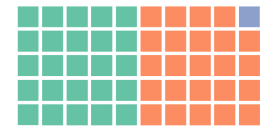
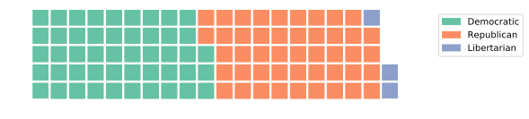
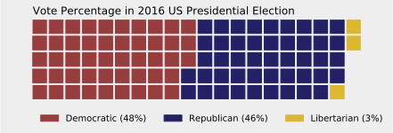
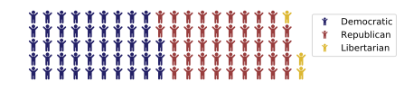

# PyWaffle

PyPI page: https://pypi.python.org/pypi/pywaffle

Documentation: Working on it

## Introduction

PyWaffle is a Python package to make waffle chart, bases on [Matplotlib](https://matplotlib.org/).

It provides a [Figure constructor class](https://matplotlib.org/gallery/subplots_axes_and_figures/custom_figure_class.html) `Waffle`, which could be passed to [matplotlib.pyplot.figure](https://matplotlib.org/api/_as_gen/matplotlib.pyplot.figure.html) and generates a matplotlib Figure object.

## Installation

```python
pip install pywaffle
```

## Examples

### 1. Basic Example

```python
import matplotlib.pyplot as plt
from pywaffle import Waffle
```

```python
# The values are rounded to 10 * 5 blocks
fig = plt.figure(FigureClass=Waffle, rows=5, columns=10, values=[48, 46, 3])
plt.show()
```



### 2. Values in dict & Auto-columns

```python
data = {'Democratic': 48, 'Republican': 46, 'Libertarian': 3}
fig = plt.figure(
    FigureClass=Waffle, rows=5, values=data, 
    legend={'loc': 'upper left', 'bbox_to_anchor': (1.1, 1)}
)
plt.show()
```



If parameter `columns` is empty, PyWaffle uses absolute number in `values` as block number.

If `values` is a dict, its keys are used as labels.

### 3. Title, Legend, Colors and Background Color

```python
data = {'Democratic': 48, 'Republican': 46, 'Libertarian': 3}
fig = plt.figure(
    FigureClass=Waffle, rows=5, values=data, colors=("#983D3D", "#232066", "#DCB732"),
    title_conf={'label': 'Vote Percentage in 2016 US Presidential Election', 'loc': 'left'},
    labels=["{0} ({1}%)".format(k, v) for k, v in data.items()],
    legend={'loc': 'lower left', 'bbox_to_anchor': (0, -0.4), 'ncol': len(data), 'framealpha': 0}
)
fig.gca().set_facecolor('#EEEEEE')
fig.set_facecolor('#EEEEEE')
plt.show()
```



It is now clear to see that there are 3% votes to other parties/candidates.

Data source [https://en.wikipedia.org/wiki/United_States_presidential_election,_2016](https://en.wikipedia.org/wiki/United_States_presidential_election,_2016).

### 4. Icons

```python
data = {'Democratic': 48, 'Republican': 46, 'Libertarian': 3}
fig = plt.figure(
    FigureClass=Waffle, rows=5, values=data, colors=("#232066", "#983D3D", "#DCB732"),
    legend={'loc': 'upper left', 'bbox_to_anchor': (1, 1)},
    icons='child', icon_size=18, icon_legend=True
)
```
    


PyWaffle supports [Font Awesome](http://fontawesome.io/) icons in the chart.

### 5. Multiple Plots

## Future works

1. Finish documents
2. Add Python 2.x supports

## License

PyWaffle uses the MIT license, see `LICENSE` file for the details.
