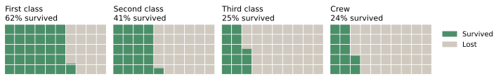

# PyWaffle

[](https://pypi.org/project/pywaffle/)
[](http://pywaffle.readthedocs.io/)
[](https://mybinder.org/v2/gh/gyli/PyWaffle/master?filepath=demo.ipynb)
[](https://pepy.tech/project/pywaffle)
[](https://github.com/gyli/PyWaffle/actions/workflows/test.yml)

PyWaffle is an open source, MIT-licensed Python package for plotting waffle charts — also known as
square pie charts, and, when drawn with icons, pictogram charts.



It provides a [Figure constructor class](https://matplotlib.org/gallery/subplots_axes_and_figures/custom_figure_class.html) `Waffle`, which could be passed to [matplotlib.pyplot.figure](https://matplotlib.org/api/_as_gen/matplotlib.pyplot.figure.html) and generates a matplotlib Figure object.

PyPI Page: [https://pypi.org/project/pywaffle/](https://pypi.org/project/pywaffle/)

Documentation: [http://pywaffle.readthedocs.io/](http://pywaffle.readthedocs.io/)

## Installation

```shell
pip install pywaffle
```

To draw [pictogram charts](https://pywaffle.readthedocs.io/en/latest/examples/plot_with_characters_or_icons.html)
with Font Awesome icons, install the optional extra:

```shell
pip install "pywaffle[icons]"
```

## Requirements

* Python 3.9+
* Matplotlib
* Font Awesome, optional, for `icons` only — `pip install "pywaffle[icons]"`

## Quickstart

A waffle chart is a grid of blocks where **one block stands for a fixed quantity**, so a proportion is
something the reader can count rather than estimate from the angle of a pie slice.

These are the people aboard the Titanic. 2,201 of them in a grid of 100 blocks, so one block is about
22 people.

```python
import matplotlib.pyplot as plt
from pywaffle import waffle_chart

aboard = {"First class": 325, "Second class": 285, "Third class": 706, "Crew": 885}

class_colors = ["#c9a227", "#5f8a8b", "#b5653f", "#3d4f5d"]
aside = {"loc": "upper left", "bbox_to_anchor": (1.02, 1), "frameon": False}

fig, ax = waffle_chart(
    aboard,
    rows=10,
    columns=10,
    colors=class_colors,
    title={"label": "Who was aboard the Titanic: 2,201 people", "loc": "left"},
    legend=aside,
    show_values=True,
    figsize=(6.5, 4),
)
```


Swap the rectangles for [Font Awesome](https://fontawesome.com/icons?d=gallery&m=free) icons and it
becomes a pictogram chart, where one figure stands for a number of people:

```python
by_group = {"Men": 1667, "Women": 425, "Children": 109}

fig, ax = waffle_chart(
    by_group,
    rows=5,
    columns=10,
    colors=["#3d4f5d", "#c9a227", "#b5653f"],
    icons=["person", "person-dress", "child"],
    font_size=22,
    icon_legend=True,
    background_color="#f4f2ee",
    title={"label": "One figure = 44 people aboard", "loc": "left"},
    legend=aside,
    show_values=True,
    figsize=(6.5, 2.8),
)
```


`waffle_chart()` returns the matplotlib `(figure, axes)` pair, so everything you already know about
matplotlib still applies. Pass `ax` to draw into a layout you have already built.

PyWaffle is also a matplotlib [Figure constructor
class](https://matplotlib.org/gallery/subplots_axes_and_figures/custom_figure_class.html), which is
the form used throughout the examples below and is fully supported:

```python
fig = plt.figure(FigureClass=Waffle, rows=10, columns=10, values=aboard)
```

Both build the same chart. Use whichever reads better in your code.

**[Read the full quickstart](https://pywaffle.readthedocs.io/en/latest/quickstart.html)** for partial
blocks that lose nothing to rounding, continuous tiled grids, sorting, subplots, and drawing into an
existing layout.

> Figures from the British Board of Trade inquiry of 1912: 2,201 aboard, 710 saved, 1,491 lost.
> Tabulated at [Sinking of the
> Titanic](https://en.wikipedia.org/wiki/Sinking_of_the_Titanic#Casualties_and_survivors).

## Examples

Every example below uses the same dataset as the quickstart: the people aboard the Titanic.

### 1. Value Scaling

```python
import matplotlib.pyplot as plt
from pywaffle import Waffle
```

```python
fig = plt.figure(
    FigureClass=Waffle,
    rows=5,
    columns=10,
    values=[325, 285, 706, 885],
    figsize=(5, 3)
)
plt.show()
```


Those are the first class, second class, third class and crew counts, 2,201 people in all. They are automatically scaled to 7, 6, 16 and 20 to fit the 5 * 10 chart size, so one block stands for about 22 people.

`FigureClass` and `figsize` are parameters of `matplotlib.pyplot.figure`, you may find the full parameter list on [matplotlib.pyplot.figure](https://matplotlib.org/stable/api/_as_gen/matplotlib.pyplot.figure.html) function reference.  

Other parameters, including `rows`, `columns`, and `values` in this example, are from `Waffle`, and see PyWaffle's [API Reference](https://pywaffle.readthedocs.io/en/latest/class.html) for details.

### 2. Values in dict & Auto-sizing

```python
data = {'First class': 6, 'Second class': 24, 'Third class': 79}
fig = plt.figure(
    FigureClass=Waffle,
    rows=5,
    values=data,
    legend={'loc': 'upper left', 'bbox_to_anchor': (1.05, 1)},
)
plt.show()
```


These are the children aboard, so here one block really is one child.

In this example, only `rows` is specified and `columns` is empty, absolute values in `values` are used as block numbers. Similarly, `rows` could also be optional if `columns` is specified.

If `values` is a dict, the keys will be used as labels in the legend.

### 3. More style settings including Legend, Title, Colors, Direction, etc.

```python
data = {'First class': 325, 'Second class': 285, 'Third class': 706, 'Crew': 885}
fig = plt.figure(
    FigureClass=Waffle,
    rows=5,
    columns=10,
    values=data,
    colors=["#c9a227", "#5f8a8b", "#b5653f", "#3d4f5d"],
    title={'label': 'Who was aboard the Titanic', 'loc': 'left'},
    labels=[f"{k} ({v})" for k, v in data.items()],
    legend={'loc': 'lower left', 'bbox_to_anchor': (0, -0.4), 'ncol': len(data), 'framealpha': 0},
    starting_location='NW',
    vertical=True
)
fig.set_facecolor('#EEEEEE')
plt.show()
```


Parameter `colors` allows you to change the block color, and it accepts a list of colors that matplotlib can recognize, including hex, RGB in tuple, single character notation, etc. See Matplotlib [Colors](https://matplotlib.org/stable/tutorials/colors/colors.html#specifying-colors) for details. 

Parameter `title` and `legend` accept the same parameters as in Matplotlib, [matplotlib.pyplot.title](https://matplotlib.org/stable/api/_as_gen/matplotlib.pyplot.title.html) and [matplotlib.pyplot.legend](https://matplotlib.org/stable/api/_as_gen/matplotlib.pyplot.legend.html).

Parameter `starting_location` and `vertical` control [Where to Start First Block](https://pywaffle.readthedocs.io/en/latest/examples/block_shape_spacing_location_direction_and_style.html#where-to-start-first-block) and [Plotting Direction](https://pywaffle.readthedocs.io/en/latest/examples/block_shape_spacing_location_direction_and_style.html#plotting-direction). Together they fill from the top left along each row, so the four groups read in order, the way a line of text does.

There is also `block_arranging_style`, which can start each category on a new line or lay the blocks out in a snake. See [Where to Start Each Category](https://pywaffle.readthedocs.io/en/latest/examples/block_shape_spacing_location_direction_and_style.html#where-to-start-each-category).

You may find more details under [Examples](https://pywaffle.readthedocs.io/en/latest/examples.html) section in PyWaffle Documentation. 

### 4. Plot with Icons - Pictogram Chart

```python
data = {'Men': 1667, 'Women': 425, 'Children': 109}
fig = plt.figure(
    FigureClass=Waffle,
    rows=5,
    columns=10,
    values=data,
    colors=["#3d4f5d", "#c9a227", "#b5653f"],
    legend={'loc': 'upper left', 'bbox_to_anchor': (1, 1)},
    icons=['person', 'person-dress', 'child'],
    font_size=18,
    icon_legend=True
)
plt.show()
```
    


The same 2,201 people, cut by group instead of by class. One figure stands for about 44 of them.

PyWaffle supports [Font Awesome](https://fontawesome.com/) icons in the chart. Font Awesome is an optional dependency, installed with `pip install "pywaffle[icons]"`. See [Plot with Characters or Icons](https://pywaffle.readthedocs.io/en/latest/examples/plot_with_characters_or_icons.html) for details.

### 5. Plotting on Existed Figure and Axis

```python
fig = plt.figure()
ax = fig.add_subplot(111)

# Modify existed axis
ax.set_title("Axis Title")
ax.set_aspect(aspect="equal")

Waffle.make_waffle(
    ax=ax,  # pass axis to make_waffle
    rows=5, 
    columns=10, 
    values=[710, 1491], 
    title={"label": "Survived and lost", "loc": "left"}
)
```


710 of the 2,201 aboard survived.

### 6. Multiple Plots in One Chart

```python
import pandas as pd
data = pd.DataFrame(
    {
        'labels': ['Men', 'Women', 'Children'],
        'First class': [175, 144, 6],
        'Second class': [168, 93, 24],
        'Third class': [462, 165, 79],
    },
).set_index('labels')

# A glance of the data:
#           First class  Second class  Third class
# labels
# Men               175           168          462
# Women             144            93          165
# Children            6            24           79

fig = plt.figure(
    FigureClass=Waffle,
    plots={
        311: {
            'values': data['First class'] / 10,  # Convert actual number to a reasonable block number
            'labels': [f"{k} ({v})" for k, v in data['First class'].items()],
            'legend': {'loc': 'upper left', 'bbox_to_anchor': (1.05, 1), 'fontsize': 8},
            'title': {'label': 'First class', 'loc': 'left', 'fontsize': 12}
        },
        312: {
            'values': data['Second class'] / 10,
            'labels': [f"{k} ({v})" for k, v in data['Second class'].items()],
            'legend': {'loc': 'upper left', 'bbox_to_anchor': (1.05, 1), 'fontsize': 8},
            'title': {'label': 'Second class', 'loc': 'left', 'fontsize': 12}
        },
        313: {
            'values': data['Third class'] / 10,
            'labels': [f"{k} ({v})" for k, v in data['Third class'].items()],
            'legend': {'loc': 'upper left', 'bbox_to_anchor': (1.05, 1), 'fontsize': 8},
            'title': {'label': 'Third class', 'loc': 'left', 'fontsize': 12}
        },
    },
    rows=5,  # Outside parameter applied to all subplots, same as below
    cmap_name="Accent",  # Change color with cmap
    rounding_rule='ceil',  # Change rounding rule, so a value under 10 still gets at least 1 block
    figsize=(6, 5)
)

fig.suptitle('Titanic passengers by class', fontsize=14, fontweight='bold')
fig.supxlabel('1 block = 10 people', fontsize=8, x=0.14)
fig.set_facecolor('#EEEDE7')

plt.show()
```
    


Each subplot is sized by its own class, so the widths show at a glance that third class carried more people than first and second combined.

> Figures throughout from the British Board of Trade inquiry of 1912: 2,201 aboard, 710 saved, 1,491 lost. Tabulated at [Sinking of the Titanic](https://en.wikipedia.org/wiki/Sinking_of_the_Titanic#Casualties_and_survivors).

## Demo

Wanna try it yourself? There is [Online Demo](https://mybinder.org/v2/gh/gyli/PyWaffle/master?filepath=demo.ipynb)!

## What's New

See [CHANGELOG](CHANGELOG.md)

## License

* PyWaffle is under MIT license, see `LICENSE` file for the details.
* The Font Awesome font is licensed under the SIL OFL 1.1: http://scripts.sil.org/OFL
