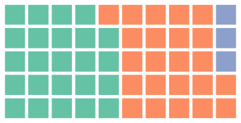
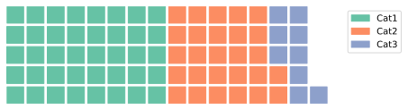

# PyWaffle

[](https://pypi.org/project/pywaffle/)
[](http://pywaffle.readthedocs.io/)
[](https://mybinder.org/v2/gh/gyli/PyWaffle/master?filepath=demo.ipynb)

PyWaffle is an open source, MIT-licensed Python package for plotting waffle charts.

It provides a [Figure constructor class](https://matplotlib.org/gallery/subplots_axes_and_figures/custom_figure_class.html) `Waffle`, which could be passed to [matplotlib.pyplot.figure](https://matplotlib.org/api/_as_gen/matplotlib.pyplot.figure.html) and generates a matplotlib Figure object.

PyPI Page: [https://pypi.org/project/pywaffle/](https://pypi.org/project/pywaffle/)

Documentation: [http://pywaffle.readthedocs.io/](http://pywaffle.readthedocs.io/)

## Installation

```python
pip install pywaffle
```

## Requirements

* Python 3.5+
* Matplotlib

## Examples

### 1. Value Scaling

```python
import matplotlib.pyplot as plt
from pywaffle import Waffle
```

```python
fig = plt.figure(
    FigureClass=Waffle, 
    rows=5, 
    columns=10, 
    values=[48, 46, 6],
    figsize=(5, 3)
)
plt.show()
```



The values are automatically scaled to 24, 23 and 3 to fit 5 * 10 chart size.

`FigureClass` and `figsize` are parameters of `matplotlib.pyplot.figure`, you may find the full parameter list on [matplotlib.pyplot.figure](https://matplotlib.org/stable/api/_as_gen/matplotlib.pyplot.figure.html) function reference.  

Other parameters, including `rows`, `columns`, and `values` in this example, are from `Waffle`, and see PyWaffle's [API Reference](https://pywaffle.readthedocs.io/en/latest/class.html) for details.

### 2. Values in dict & Auto-sizing

```python
data = {'Cat1': 10, 'Cat2': 7, 'Cat3': 9}
fig = plt.figure(
    FigureClass=Waffle,
    rows=5,
    values=data,
    legend={'loc': 'upper left', 'bbox_to_anchor': (1.05, 1)},
)
plt.show()
```



In this example, only `rows` is specified and `columns` is empty, absolute values in `values` are used as block numbers. Similarly, `rows` could also be optional if `columns` is specified.

If `values` is a dict, the keys will be used as labels in the legend.

### 3. More style settings including Legend, Title, Colors, Direction, Arranging Style, etc.

```python
data = {'Car': 58, 'Pickup': 21, 'Truck': 11, 'Motorcycle': 7}
fig = plt.figure(
    FigureClass=Waffle,
    rows=5,
    values=data,
    colors=["#C1D82F", "#00A4E4", "#FBB034", '#6A737B'],
    title={'label': 'Vehicle Sales by Vehicle Type', 'loc': 'left'},
    labels=[f"{k} ({v}%)" for k, v in data.items()],
    legend={'loc': 'lower left', 'bbox_to_anchor': (0, -0.4), 'ncol': len(data), 'framealpha': 0},
    starting_location='NW',
    vertical=True,
    block_arranging_style='snake'
)
fig.set_facecolor('#EEEEEE')
plt.show()
```


Parameter `colors` allows you to change the block color, and it accepts a list of colors that matplotlib can recognize, including hex, RGB in tuple, single character notation, etc. See Matplotlib [Colors](https://matplotlib.org/stable/tutorials/colors/colors.html#specifying-colors) for details. 

Parameter `title` and `legend` accept the same parameters as in Matplotlib, [matplotlib.pyplot.title](https://matplotlib.org/stable/api/_as_gen/matplotlib.pyplot.title.html) and [matplotlib.pyplot.legend](https://matplotlib.org/stable/api/_as_gen/matplotlib.pyplot.legend.html).

Parameter `starting_location`, `vertical`, and `block_arranging_style` controls [Where to Start First Block](https://pywaffle.readthedocs.io/en/latest/examples/block_shape_spacing_location_direction_and_style.html#where-to-start-first-block), [Plotting Direction](https://pywaffle.readthedocs.io/en/latest/examples/block_shape_spacing_location_direction_and_style.html#plotting-direction), and [Where to Start Each Category](https://pywaffle.readthedocs.io/en/latest/examples/block_shape_spacing_location_direction_and_style.html#where-to-start-each-category). 

You may find more details under [Examples](https://pywaffle.readthedocs.io/en/latest/examples.html) section in PyWaffle Documentation. 

### 4. Plot with Icons - Pictogram Chart

```python
data = {'Car': 58, 'Pickup': 21, 'Truck': 11, 'Motorcycle': 7}
fig = plt.figure(
    FigureClass=Waffle,
    rows=5,
    values=data,
    colors=["#c1d82f", "#00a4e4", "#fbb034", '#6a737b'],
    legend={'loc': 'upper left', 'bbox_to_anchor': (1, 1)},
    icons=['car-side', 'truck-pickup', 'truck', 'motorcycle'],
    font_size=12,
    icon_legend=True
)
plt.show()
```
    


PyWaffle supports [Font Awesome](https://fontawesome.com/) icons in the chart. See [Plot with Characters or Icons](https://pywaffle.readthedocs.io/en/latest/examples/plot_with_characters_or_icons.html) for details.

### 5. Plotting on Existed Figure and Axis

```python
fig = plt.figure()
ax = fig.add_subplot(111)

# Modify existed axis
ax.set_title("Axis Title")
ax.set_aspect(aspect="equal")

Waffle.make_waffle(
    ax=ax,  # pass axis to make_waffle
    rows=5, 
    columns=10, 
    values=[30, 16, 4], 
    title={"label": "Waffle Title", "loc": "left"}
)
```


### 6. Multiple Plots in One Chart

```python
import pandas as pd
data = pd.DataFrame(
    {
        'labels': ['Car', 'Truck', 'Motorcycle'],
        'Factory A': [32384, 13354, 5245],
        'Factory B': [22147, 6678, 2156],
        'Factory C': [8932, 3879, 896],
    },
).set_index('labels')

# A glance of the data:
#             Factory A  Factory B  Factory C
# labels
# Car             27384      22147       8932
# Truck            7354       6678       3879
# Motorcycle       3245       2156       1196

fig = plt.figure(
    FigureClass=Waffle,
    plots={
        311: {
            'values': data['Factory A'] / 1000,  # Convert actual number to a reasonable block number
            'labels': [f"{k} ({v})" for k, v in data['Factory A'].items()],
            'legend': {'loc': 'upper left', 'bbox_to_anchor': (1.05, 1), 'fontsize': 8},
            'title': {'label': 'Vehicle Production of Factory A', 'loc': 'left', 'fontsize': 12}
        },
        312: {
            'values': data['Factory B'] / 1000,
            'labels': [f"{k} ({v})" for k, v in data['Factory B'].items()],
            'legend': {'loc': 'upper left', 'bbox_to_anchor': (1.2, 1), 'fontsize': 8},
            'title': {'label': 'Vehicle Production of Factory B', 'loc': 'left', 'fontsize': 12}
        },
        313: {
            'values': data['Factory C'] / 1000,
            'labels': [f"{k} ({v})" for k, v in data['Factory C'].items()],
            'legend': {'loc': 'upper left', 'bbox_to_anchor': (1.3, 1), 'fontsize': 8},
            'title': {'label': 'Vehicle Production of Factory C', 'loc': 'left', 'fontsize': 12}
        },
    },
    rows=5,  # Outside parameter applied to all subplots, same as below
    cmap_name="Accent",  # Change color with cmap
    rounding_rule='ceil',  # Change rounding rule, so value less than 1000 will still have at least 1 block
    figsize=(6, 5)
)

fig.suptitle('Vehicle Production by Vehicle Type', fontsize=14, fontweight='bold')
fig.supxlabel('1 block = 1000 vehicles', fontsize=8, x=0.14)
fig.set_facecolor('#EEEDE7')

plt.show()
```
    


## Demo

Wanna try it yourself? There is [Online Demo](https://mybinder.org/v2/gh/gyli/PyWaffle/master?filepath=demo.ipynb)!

## What's New

See [CHANGELOG](CHANGELOG.md)

## License

* PyWaffle is under MIT license, see `LICENSE` file for the details.
* The Font Awesome font is licensed under the SIL OFL 1.1: http://scripts.sil.org/OFL
