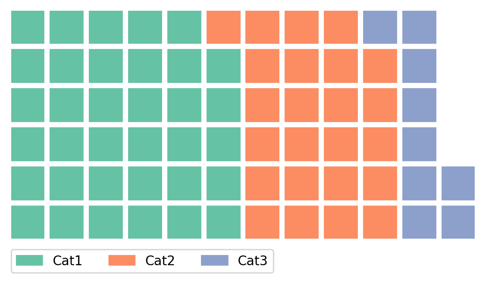
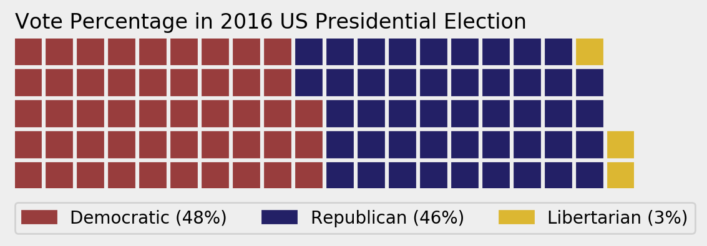

PyWaffle
========

PyPI page: https://pypi.python.org/pypi/pywaffle

Documentation: Working on it

Introduction
------------

PyWaffle is a Python package to make waffle chart, bases on `Matplotlib <https://matplotlib.org/>`__.

Please note that this package is under heavy development currently. Do NOT use it until it reaches the first stable version.

Installation
------------

.. code:: bash

    pip install pywaffle

Examples
--------

Basic example:

.. code:: python

    import matplotlib.pyplot as plt
    from pywaffle import Waffle

    fig = plt.figure(FigureClass=Waffle, rows=6, columns=10, values=[30, 20, 10])
    plt.show()

.. raw:: html
    

Use dictionary; Use absolute value as block number, without defining columns:

.. code:: python

    fig = plt.figure(FigureClass=Waffle, rows=6, values={'Cat1': 35, 'Cat2': 24, 'Cat3': 9})
    plt.show()

Add title, legend and background color:

.. code:: python

    fig = plt.figure(FigureClass=Waffle, rows=6, values={'Cat1': 35, 'Cat2': 24, 'Cat3': 9},
                     title_args={'label': 'Here is the title', 'loc': 'left'},
                     legend_args={'loc': (0, -0.15), 'facecolor': '#EAEAEA'})
    fig.gca().set_facecolor('#EAEAEA')
    fig.set_facecolor('#EAEAEA')
    plt.show()

License
-------

PyWaffle uses the MIT license, see ``LICENSE`` file for the details.
